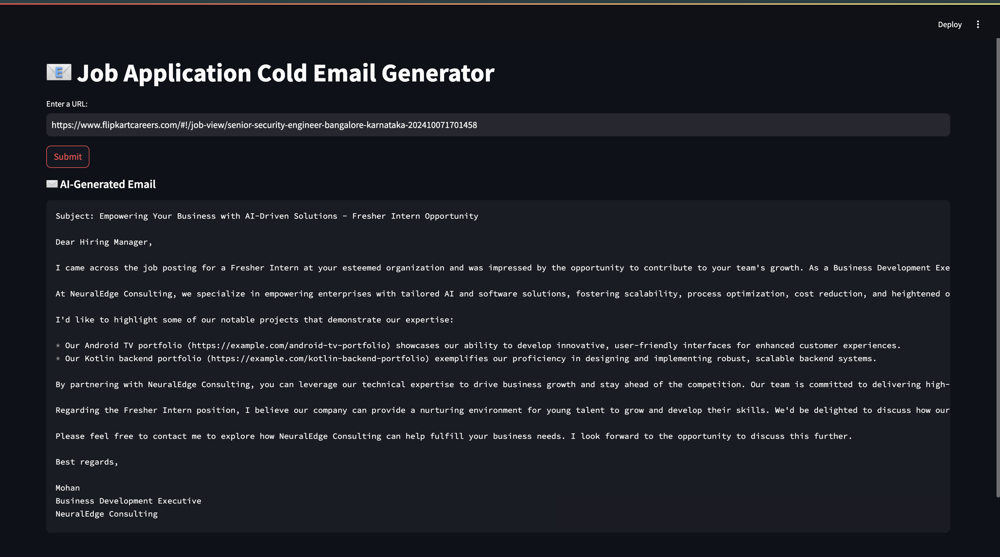

# Job Application Cold Email Generator

This is an AI-powered cold email generator that scrapes job details from a URL, extracts job requirements, and generates personalized cold emails tailored to the job description. The project leverages GroqCloud's language model and various libraries like LangChain, ChromaDB, and others for advanced functionality.




## Table of Contents
- [Features](#features)
- [Setup Instructions](#setup-instructions)
- [Architecture Diagram](#architecture-diagram)
- [Libraries Used](#libraries-used)
- [How to Use](#how-to-use)
- [Cloning the Repository](#cloning-the-repository)

## Features
- Scrapes job details from job listing pages.
- Generates personalized cold emails for job applications.
- Integrates with a portfolio to showcase skills and relevant projects.
- Powered by GroqCloud's `llama-3.3-70b-versatile` model, LangChain for chaining LLM calls, and ChromaDB for efficient vector-based search.

## Setup Instructions

### 1. Clone the Repository

To clone the repository, use the following command:

```bash
git clone https://github.com/Muazzam741/Cold-Email-Generator.git
cd your-repo
```

### 2. Install Dependencies

Make sure you have Python 3.8 or higher installed. Then, install the necessary dependencies by running:

```bash
pip install -r requirements.txt
```

### 3. Create a `.env` File

In the app directory, create a `.env` file and paste your GroqCloud API key as follows:

```
GROQ_API_KEY=your_api_key_here
```

To get your **GROQ_API_KEY**, follow these steps:
1. Go to [GroqCloud](https://groq.ai) and sign up or log in.
2. After logging in, navigate to your API settings.
3. Copy your API key and paste it into the `.env` file under the `app/resource` directory.

Make sure the `.env` file is placed in the `app/resource/` directory for the app to correctly read the API key.

### 4. Run the Application

After setting up the environment, run the application using Streamlit:

```bash
streamlit run app/main.py
```

Your application will be accessible at `http://localhost:8501`.

## Architecture Diagram


## Libraries Used

### 1. **GroqCloud**
GroqCloud is a powerful platform for running large-scale AI models. We are using the `ChatGroq` class to interact with their API and use the `llama-3.3-70b-versatile` model for text extraction and cold email generation.

Why we used it:
- **High-quality language models**: GroqCloud's API provides access to high-quality models like `llama-3.3-70b-versatile` for both text extraction and email generation.
- **Performance**: The GroqCloud platform is designed for fast and efficient API calls, making it an ideal choice for generating cold emails in real-time.

### 2. **LangChain**
LangChain is a framework designed to assist in the development of applications that use large language models (LLMs) and chains of prompts. We are using LangChain to create prompt templates for job extraction and email generation, allowing us to easily interface with GroqCloud's language model.

Why we used it:
- **Simplified API**: LangChain simplifies the process of working with large language models, making it easy to create and manage prompt templates.
- **Chain management**: LangChain allows us to build a "chain" of tasks, where one model's output is the next model's input, allowing for easy integration of multiple steps (like job extraction and email writing).

### 3. **ChromaDB**
ChromaDB is a vector-based database used for efficient similarity search. We are using it to store and query relevant links from a portfolio, based on the skills required for the job position.

Why we used it:
- **Efficient Vector Search**: ChromaDB allows us to efficiently store and search vectors, enabling the retrieval of relevant portfolio links based on job requirements.
- **Integration with LangChain**: ChromaDB is easy to integrate with LangChain, making it a natural choice for our project.

### 4. **Pandas**
Pandas is a data manipulation library, and we use it to load and manage our portfolio data from a CSV file.

Why we used it:
- **Data Handling**: Pandas makes it simple to read and manipulate data, especially when dealing with CSV files and structured data like job descriptions and portfolio links.

### 5. **Streamlit**
Streamlit is used to build the frontend of the application. It enables rapid prototyping of interactive web applications with minimal code.

Why we used it:
- **Ease of Use**: Streamlit allows us to quickly build and deploy web applications, which is ideal for this project as it focuses on providing a user-friendly interface for generating cold emails.

## How to Use

1. **Enter a URL**: Type or paste a job listing URL (e.g., `https://jobs.nike.com/job/R-33460`).
2. **Click Submit**: Once you click "Submit," the app will scrape the job details from the URL and extract the relevant information (role, experience, skills, etc.).
3. **Generated Email**: The app will generate a cold email using the extracted job details and display it on the screen.

You can then copy the generated email and use it to apply for the job.

## Contributing

If you would like to contribute to this project, feel free to fork the repository, create a new branch, and submit a pull request. We welcome any improvements or suggestions.

## License

This project is licensed under the MIT License - see the [LICENSE](LICENSE) file for details.

---

Enjoy using the Job Application Cold Email Generator! 🎉
